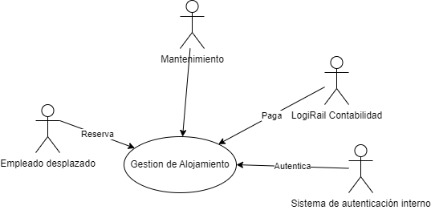
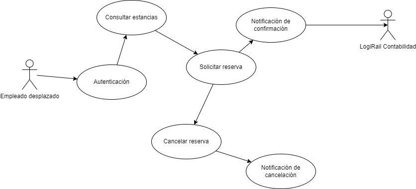

# Proyecto Alojamientos LogiRail

[TestLink](https://testlink.remmko.online)

## Vision de producto:
Alojamientos LogiRail es una plataforma integral diseñada para facilitar la gestión y asignación de Alojamientos a los empleados de Renfe. El objetivo principal es proporcionar un sistema eficiente y transparente que optimice la experiencia de vivienda para los trabajadores desplazados.

## Características Clave:

### Portal de Reservas:
- Los empleados pueden acceder a un portal en línea para buscar, reservar y gestionar Alojamientos disponibles.
- La plataforma muestra detalles como ubicación, tamaño, comodidades y disponibilidad.

### Seguimiento de Mantenimiento:
- Los administradores pueden registrar y programar tareas de mantenimiento para cada apartamento.
- Los empleados pueden informar problemas o solicitar reparaciones a través de la plataforma.

### Comunicación Interna:
- Alojamientos LogiRail permite la comunicación directa entre los empleados y los administradores de viviendas.
- Los anuncios importantes, actualizaciones y recordatorios se envían a través de la plataforma.

## Beneficios:
- **Eficiencia:** Simplifica la asignación y seguimiento de Alojamientos, reduciendo la carga administrativa.
- **Transparencia:** Los empleados pueden ver opciones disponibles y realizar reservas de manera transparente.
- **Bienestar:** Proporciona un entorno cómodo y seguro para los trabajadores desplazados.
- **Optimización de Recursos:** Ayuda a utilizar los Alojamientos de manera más efectiva.

## Características:

### Ubicación Privilegiada
Ubicados en el corazón de la ciudad, nuestros Alojamientos ofrecen fácil acceso a los principales distritos comerciales, centros de transporte, centros comerciales y instalaciones recreativas. ¡Di adiós a los largos desplazamientos y hola a más tiempo para ti mismo!

### Distribuciones Espaciosas
Nuestros Alojamientos vienen en una variedad de tamaños para adaptarse a tus necesidades, ya sea que seas un trabajador solitario o compartas espacio con compañeros de piso. Disfruta de un amplio espacio de vida, dormitorios acogedores y cocinas modernas equipadas con todos los elementos esenciales para una vida conveniente.

### Comodidades Modernas
Experimenta la conveniencia de comodidades modernas como internet de alta velocidad, instalaciones de lavandería en el lugar, gimnasios y estacionamiento seguro. Trabaja, relájate y socializa sin tener que salir nunca del confort de tu edificio.

### Entorno Tranquilo
Escapa del bullicio de la ciudad en nuestros entornos pacíficos y bien mantenidos. Nuestros Alojamientos ofrecen un refugio tranquilo donde puedes relajarte después de un largo día de trabajo, recargar tus baterías y prepararte para los desafíos que se presenten.

### Ambiente Comunitario
Únete a una comunidad vibrante de individuos con ideas afines que comparten tu pasión por el trabajo y el ocio. Participa en eventos para residentes, oportunidades de networking y reuniones sociales para construir conexiones y amistades.

## Diagrama de contexto

## Empleado desplazado

## Mantenimiento

